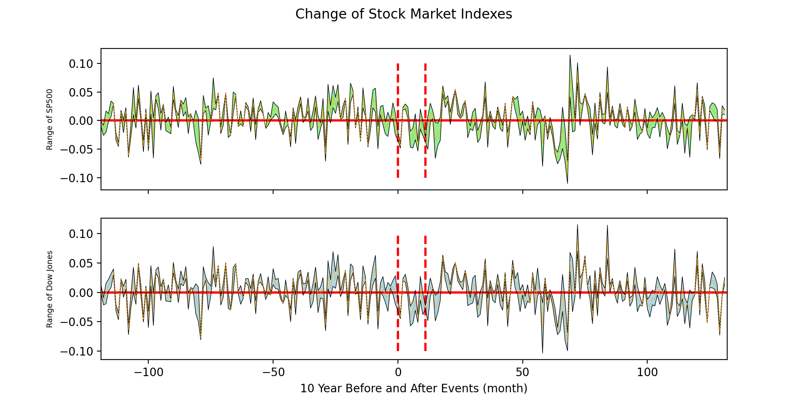
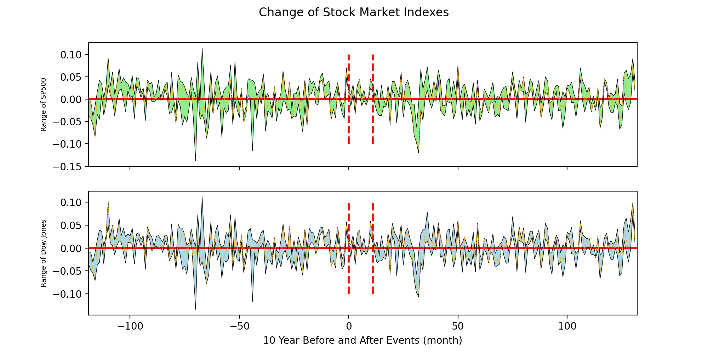

# Evolution of Inflation/GDP/Stock Market before and after Wars/Pandemics (Type I)

Group members: Kangyang Wang (*kangyangwang*), Wendy Zhu (*wheeendiii*), and Kay Avila (*kayavila*)

## Reference Articles:
* https://voxeu.org/article/inflation-aftermath-wars-and-pandemics
* https://www.goldmansachs.com/insights/pages/gs-research/reflation-risk/report.pdf

## Potential Questions and Improvements:

Based on the analysis of the above two articles, the authors conclude that, overall, "wars result in higher inflation and bond yields, 
pandemics do not". This conclusion is supported by several well-plotted graphs of Consumer Price Index (CPI) Inflation or Nominal ten-year bond 
yields around wars and pandemics. More specifically, the authors used the last year of significant fatalities as the 
end-year for wars and pandemics (Year = 0) (In a number of instances, this is one year before the formal end of the 
war/pandemics) and overlaid the historical CPI Inflation/Bond Yield data 10 years before and after the year 0 to monitor
the evolution of Inflation and Bond Yield before and after each event.

The analysis of the articles seems well organized, but we have several concerns:
* The conclusion is contradicting with what we are experiencing now. As we know, the CPI inflation rate is surging since the 
outbreak of COVID-19 and is reaching a 30-year record high recently.
* The conclusion in the article didn't consider many inner factors of the events, such as the fatalities and the duration of the events. 
Would they affect the final overall trend of the CPI Inflation and bond yield around the events?
* Are there any significant market vibrations (changes of major market indexes) before and after wars and pandemics?

As we investigate these, we will look specifically at the United States, and see if the authors' proposals hold true
for this one country in particular, using events that have influenced it.

## Hypotheses

* CPI - For the United States, we follow the authors' hypothesis that wars will result in higher inflation in the near term after the end of the war (as indicated by the consumer price index), but pandemics will not.
* GDP - The growth of GDP will be exceptionally strong during wars and will remain an increasing trend afterwards, whereas pandemics exhibit minor impact on GDP growth. 
* S&P 500 and Dow Jones
  1. In the aftermath of wars and pandemics, the major stock market indexes (S&P500 and Dow Jones) will slide down due to the impacted economic conditions. 
  2. The major stock market indexes (S&P500 and Dow Jones) will be more volatile after the start of the wars/pandemics.

## Data Sources
### Event Data

This data file is compiled from the wars and pandemics chart in the reference article "Inflation in the aftermath of wars and pandemics" (https://voxeu.org/article/inflation-aftermath-wars-and-pandemics) and the Wiki pages for wars and pandemics("List of epidemics" - https://en.wikipedia.org/wiki/List_of_epidemics, "Timeline of wars" - https://en.wikipedia.org/wiki/Timeline_of_wars).

**Note: We modified our original event dataset to focus only on the events that are significantly related to U.S.** The pandemics/epidemics selected in this dataset are based on the article "The Worst Outbreaks in U.S. History"[^2].

### Consumer Price Index (CPI)
* CPI for US from 1913-present - https://beta.bls.gov/dataViewer/view/timeseries/CUUR0000SA0
* CPI for G20 countries from 1915-present -  https://stats.oecd.org/Index.aspx?DataSetCode=G20_PRICES# 

Consumer price index represents the change in prices that consumers are paying for common household goods, 
including food, gas, and prescription drugs.

The US CPI data set comes from the United States Bureau of Labor Statistics website, which has data available
from 1913 through the present year.  The values are relative to each other. That is, rather than discrete amounts, 
the index represents the change in prices from year to year, based on a "base index".  The base index for
this dataset is calculated by taking the average of the period from January 1982 through December 1984 and 
setting it at 100[^1].  All other index values are then given as a percentage change from that value.

### Gross Domestic Product (GDP)
* GDP for all countries from 1929-present - https://databank.worldbank.org/reports.aspx?source=2&type=metadata&series=NY.GDP.MKTP.CD#

### S&P500 and Dow Jones
* S&P500 historical monthly nominal and real (inflation adjusted) data from 1927 - https://www.macrotrends.net/2324/sp-500-historical-chart-data
* Dow Jones historical monthly nominal and real (inflation adjusted) data from 1915 - https://www.macrotrends.net/1319/dow-jones-100-year-historical-chart

## Conclusions

### Consumer Price Index (CPI) before and after Wars and Pandemics

First we plotted individual pandemics/epidemics and wars.  The year that the event ended is
set as time zero.  The plot lines end early when no data for an event exists.  For instance,
the two ongoing health events, covid-19 and HIV/AIDS, are plotted for 2021 as year zero, which
is the last year for which there is data.

Notably, the graphs for diptheria epidemic and Spanish flu look the same, because they have an
overlapping time period with the former ending in 1925 and the latter ending in 1920.  The time
period for these two events also overlap with the United States' involvement in World War I, which
lasted from 1914 to 1918.  This makes it hard to draw independent conclusions for events during
that time.

In order to get a higher level picture, we also plotted the 25% and 75% percentiles and median
of the values, as well as the mean of the values.

The quartiles for the pandemics have a wider band than the wars, meaning the pandemics follow
less of a strict pattern than the wars.  On average, the pandemics have a much smaller increase
in the rate of inflation at their end than the wars do.

Wars have a narrower range of inflation change values, except right after the end of the war.
Here, they exhibit a large range.  Looking at the individual graphs above, the events that
most notably lead to an increase in inflation in the United States were World War I and World
War II, as well as the Vietnam War.  Many of the other wars did not seem to have a noticeable
impact on inflation when they ended.

From these results, we conclude that the authors conclusions (and our hypothesis following them)
were correct on average.  Inflation tends to increase after wars end but not as noticeably after
pandemics.  However, as we've seen, this is far from guaranteed.

### Gross Domestic Product (GDP) before and after Wars and Pandemics

1. Overall GDP and subcategories (Personal consumption expenditures, Gross private domestic investment and Government consumption expenditures and gross investment)

2. Pandemics Vs. Wars
* GDP fluctuations for SARS outbreak, Ebola virus epidemic and COVID-19 pandemic:

**Most Pandemics have negligible influences on GDP, except for that during COVID-19.**

* GDP fluctuations for Korean War and World War II:

**GDP during wars is fluctuating and government consumption contributes the most and leads to increase in GDP.**

### S&P500 and Dow Jones before and after Wars and Pandemics

**Monthly historical data for S&P500 and Dow Jones are used in the plots below. x = 0 is the January of the selected "Year Zero".** 

1. If we use the year before the event end year as zero point, and select the inflation adjusted SP500 and Dow Jones historical data 10 years before and after the zero point year, plots would be:

* The evolution of real SP500 and Dow Jones 10 years before and after all the Pandemics:
['Asian Flu', 'Hong Kong Flu', 'London flu', 'Russian flu', 'HIV/AIDS pandemic', 'SARS outbreak', 'Swine flu pandemic']

* The evolution of real SP500 and Dow Jones 10 years before and after all the Wars:
['Korean War', 'Vietnam War', 'World War II', 'Gulf War', 'Civil war in Afghanistan', 'War on Terror', 'Iraq War', 'War in Somalia']

* The evolution of real SP500 and Dow Jones 10 years before and after Pandemics with over 1m fatalities:
['Asian Flu', 'Hong Kong Flu', 'HIV/AIDS pandemic']

* The evolution of real SP500 and Dow Jones 10 years before and after Wars with over 1m fatalities:
['Korean War', 'Vietnam War', 'World War II', 'War in Somalia']

2. If we use the event start year as zero point, and select the real SP500 and Dow Jones historical data 5 years before and after the zero point year, plots would be

* The evolution of real SP500 and Dow Jones 5 years before and after all the Pandemics:

* The evolution of real SP500 and Dow Jones 5 years before and after all the Wars:

* The evolution of real SP500 and Dow Jones 5 years before and after Pandemics with over 1m fatalities:

* The evolution of real SP500 and Dow Jones 5 years before and after Wars with over 1m fatalities:

## References
[^1]: https://www.bls.gov/cpi/questions-and-answers.htm#Question_17
[^2]: https://www.healthline.com/health/worst-disease-outbreaks-history
